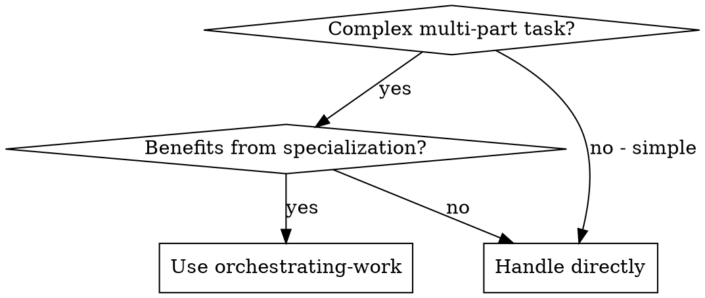

# Orchestrating Work (Two-Tier Agent Pattern)

Decompose complex requests into focused subtasks and delegate each to a specialist worker subagent.

**Core principle:** Manager plans and delegates. Workers execute. Manager synthesizes.

## When to Use



**Use when:**
- Task has 3+ distinct subtasks
- Different skills needed (research, code, review)
- Subtasks can be defined independently
- Quality benefits from focused attention

**Don't use when:**
- Task is straightforward
- Heavy interdependencies between parts
- Exploratory work (don't know scope yet)

## The Pattern

### Phase 1: Analyze & Plan (You are the Manager)

Before delegating, decompose the request:

1. **Identify objectives** - What outcomes does the user need?
2. **Break into subtasks** - Each should be atomic and focused
3. **Assign workers** - Match subtask to specialist:
   - `coder` - Write, modify, debug code
   - `researcher` - Investigate, analyze, recommend
   - `reviewer` - Evaluate quality, find issues
4. **Order execution** - Sequential if dependencies, parallel if independent
5. **Define done** - Measurable criteria for completion

### Phase 2: Delegate (Dispatch Worker Subagents)

For each subtask, dispatch a worker using the Task tool:

```
Task tool (general-purpose):
  description: "[Worker]: [brief task]"
  prompt: [Use worker prompt template from ./workers/]
```

**Worker prompt templates:**
- `./workers/coder-prompt.md` - Implementation tasks
- `./workers/researcher-prompt.md` - Investigation tasks
- `./workers/reviewer-prompt.md` - Quality review tasks

### Phase 3: Synthesize (Verify & Integrate)

After workers return:

1. **Review each result** - Did worker complete successfully?
2. **Check for INCAPABLE** - Reassign or handle differently
3. **Verify integration** - Do results work together?
4. **Check Definition of Done** - All criteria met?
5. **Report to user** - Summary with artifacts

## Example Workflow

```
User: "Create a rate limiter middleware for Express with sliding window"

--- PHASE 1: PLAN ---

Objectives:
1. Functional rate limiter middleware
2. Sliding window algorithm (not fixed window)
3. Configurable limits
4. Proper HTTP responses

Subtasks:
1. [researcher] Research sliding window algorithms for rate limiting
2. [coder] Implement the middleware based on research
3. [reviewer] Review implementation for edge cases and security

Execution: Sequential (2 depends on 1, 3 depends on 2)

Definition of Done:
- Middleware limits requests per IP
- Uses sliding window (not fixed)
- Configurable time window and max requests
- Returns 429 with Retry-After header
- Handles edge cases (no IP, concurrent requests)

--- PHASE 2: DELEGATE ---

[Dispatch researcher subagent with ./workers/researcher-prompt.md]
Researcher returns: Analysis of token bucket vs sliding window log vs sliding window counter...

[Dispatch coder subagent with ./workers/coder-prompt.md + researcher findings]
Coder returns: Implementation + tests

[Dispatch reviewer subagent with ./workers/reviewer-prompt.md]
Reviewer returns: Review with findings

--- PHASE 3: SYNTHESIZE ---

✓ Researcher provided algorithm recommendation
✓ Coder implemented with tests passing
✓ Reviewer approved (minor suggestions addressed)
✓ All Definition of Done criteria met

[Report to user with code artifact]
```

## Key Principles

### Manager Responsibilities
- **Never do the work** - Only plan, delegate, verify
- **Provide context** - Workers get what they need upfront
- **Define scope clearly** - Workers know exactly what to do
- **Verify completion** - Check against Definition of Done

### Worker Characteristics
- **Stateless** - Only know their subtask, not full request
- **Focused** - One clear goal, one specialty
- **Honest** - Report INCAPABLE if task doesn't fit
- **Structured output** - Return results in expected format

### Communication
- Manager provides full context to workers
- Workers don't read the original request
- Workers return structured results
- Manager integrates everything

## Red Flags

**❌ Manager doing work:** If you're writing code or researching, stop. Delegate.
**❌ Vague subtasks:** "Handle the backend" → Be specific about what to build
**❌ Missing context:** Worker asks questions → You didn't provide enough upfront
**❌ Skipping review:** Always have a reviewer check code
**❌ Ignoring INCAPABLE:** Worker said they can't → Reassign or rethink

## Integration with Other Skills

**Works well with:**
- **superpowers:writing-plans** - For larger initiatives, write plan first
- **superpowers:test-driven-development** - Coder workers should follow TDD
- **superpowers:dispatching-parallel-agents** - When subtasks are independent

**Sequence:**
1. Use `writing-plans` if task is large/complex
2. Use `orchestrating-work` to execute each plan section
3. Workers use `test-driven-development` for code tasks
